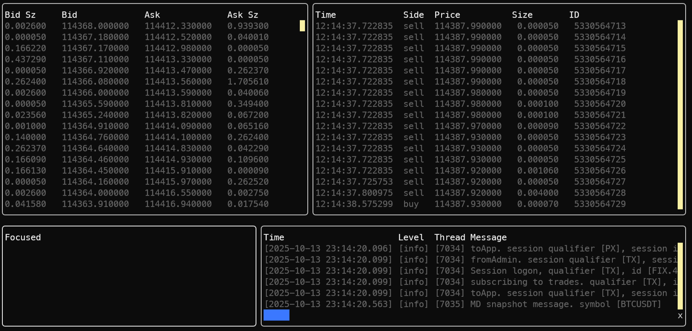

<!--  -->

# trader.cpp
a proof-of-concept, showcasing some c++ coding combined with some fintech concepts

## Run Requirements
- a Binance account, with an Ed25519 token that has FIX read permissions enabled 
- `stunnel` for TLS encryption (or a local proxy)

## Build Requirements
- C++20
- `python3`, `python3.8-venv`, pip
- Conan (tested with >= 2)
- CMake (tested with >= 4)
- `ninja`

## Dev Requirements
- `make` (convenience)
- `gdb`
- `clang-tidy`
- `clang-format`
- `lcov`

## Build and Run
(NB: this app uses `make` as a task runner, but it's not essential)
1. copy `.env.example` to `.env`, and set your public/private keys
2. run an SSL tunnel (e.g. `stunnel binance/stunnel_prod.conf`)
3. `make init`
4. `make build-debug`
5. `make withenv RECIPE=run-debug`

## Test
`make test`

## Debug
- vscode
  - app and test debug profiles are pre-configured in the following files:
    - `.vscode/launch.json`
    - `.vscode/tasks.json`
- intellij (clion)
  - enable the `debug` CMake profile

## Help
`make`

## Cloud Config
- Sonarcloud (click the badge)
- Codecov (click the badge)

# Aims

## Functional
- ✅ create a FIX connection to Binance
  - separate price/trade/order sessions
  - server maintenance, News <B> messages
  - per-session execution reports / Response Mode
  - track message limits
  - OrderMassCancelRequest on error
- ✅ subscribe to price updates
- create a basic trading signal (e.g. standard deviations)
- use a precise number type for money
- fire an order
- test in the Binance test environment
- momentum indicators
- throughput indicators (messages/sec)
- orders
  - update balance for in-flight orders (reconcile asynchronously)

## Non-functional
- ✅ basic cpp app to start with
- ✅ makefile and build chain
- ✅ package management
- ✅ debugging
- ✅ single-threaded to start with, then re-architect (and mermaid diagram)
- ✅ UI
  - ✅ publish messages to thread-safe queue
  - ✅ consume messages from thread-safe queue on a worker thread
  - interrupt/ctrl+c signal
  - 60fps limit
- ✅ logging
    - ✅ fast
    - ✅ compiled out 'debug' logging for release builds
    - output thread name
    - rolling
    - structured
    - basic schema (severity, correlationId)
    - thread context in logs
- code quality
  - ✅ clang-format
    - ✅ configure editor to auto-format
    - ✅ fail commits if not formatted
    - ✅ fail builds if not formatted
  - clang-tidy
    - ✅ all files tidied
    - ✅ configured clang-tidy => clang-format
    - ✅ fail commits/merges if not tidy
    - ✅ fail builds if not tidy
    - ✅ `clang-tidy-diff.py` (alias 18)
  - ✅ git hooks
  - ✅ integrated into build pipeline
  - ✅ badges
  - ✅ sonarcloud integrated into build pipeline
  - sonarcloud coverage
- diagnostics
  - ✅ ASan
  - UBSan
  - TSan
  - Valgrind
- pipeline
  - ✅ custom docker build image with all dependencies (hosted on GHCR for faster pipelines)
  - ✅ cron
    - ✅ comprehensive clang-tidy & clang-format checks
    - sonarcloud
  - ccache or precomiled headers
  - local github action runner (`act`)
  - containerised integration tests / dind
- testing
  - ✅ dependency injection
  - integration test with mocked Binance server
  - UI snapshot testing
  - ✅ coverage gutters
- performance
  - release compile flags
  - profiling (valgrind/cachegrind)
  - gperftools
  - profile-guided optimization (pgo)
  - load test with mocked FIX server
  - tcmalloc / gperftools
- latency
  - sparse arrays & flat matrix
  - memory-mapped files
  - (analyse) find Binance's server location for a low-latency connection
  - (analyse) how to quantify latency?
  - FIX SSL connectivity, to avoid stunnel latency overhead
  - QuickFIX alternative (Fix8)
  - kernel space vs user space
  - RT OS
- release process
  - versioning
    - master branch merge check for conventional commit message (e.g. regex)
    - maybe a merge git gook check
    - automated semantic versioning
    - github-changelog-generator
- observability
  - opentelemetry (asynchronous)
  - grafana+tempo via docker-compose
- FIX
  - ✅ debug quickfix to confirm if it's running in it's own thread
  - switch to Fix8
- other
  - nix
  - decimal type
  - zeromq + protobufs?
  - shellcheck?
  - conan build_requires
- deployment
  - terraform

# Design

# Credits
- https://github.com/binance/binance-fix-connector-python
- harjus
