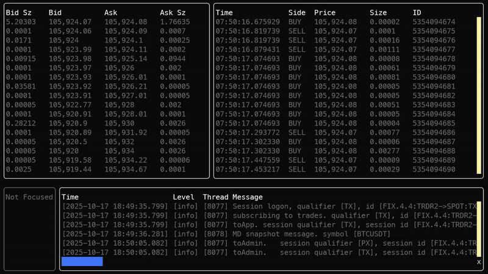
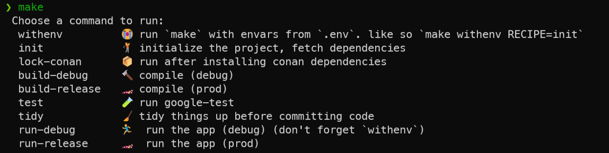
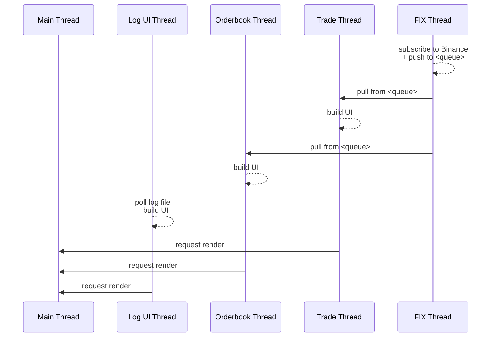

# trader.cpp
Small trading UI connected to Binance over their FIX API. 
A proof-of-concept, showcasing some modern c++ and some fintech concepts.

## Run Requirements
- linux (tested with debian-trixie)
- `stunnel` for TLS encryption (or a local proxy)
- a Binance account, and an Ed25519 token with FIX read permissions enabled
- `sudo` permissions (for elevated process and thread priorities)

## Run
- start an SSL tunnel
  - e.g. run `stunnel stunnel_prod.conf` (from the binance folder)
- configure:
  - copy `fixconfig` (from the binance folder)
  - copy `spot-fix-md.xml` (from the binance folder) and edit references in fixconfig
  - copy your binance private key pem and your public api key
  - copy `.env.example` to `.env`, edit values, and source the file
- run:
  - download release
  - `chmod u+x tradercpp`
  - `sudo ./tradercpp`

## Build Requirements
- C++20
- `python3`, `python3.8-venv`, pip
- Conan (tested with >= 2)
- CMake (tested with >= 4)
- `ninja`

## Dev Requirements
- `make` (convenience)
- `gdb`
- `clang-tidy`
- `clang-format`
- `lcov`

## Build and Run
NB: this app uses `make` as a recipe book, but it's not essential:

1. copy `.env.example` to `.env`, and set your public/private keys
2. run an SSL tunnel (e.g. `stunnel binance/stunnel_prod.conf`)
3. `make init`
4. `make build-debug`
5. `sudo make withenv RECIPE=run-debug`

## Test
`make test`

## Debug
- vscode
  - app and test debug profiles are pre-configured in the following files:
    - `.vscode/launch.json`
    - `.vscode/tasks.json`
- intellij (clion)
  - enable the `debug` CMake profile

## Help
`make`

## Cloud Config
- Sonarcloud (click the badge)
- Codecov (click the badge)

# Aims

## Functional
- ✅ create a FIX connection to Binance
  - ✅ separate price/trade/order sessions
  - server maintenance, News <B> messages
  - per-session execution reports / Response Mode
  - track message limits
  - OrderMassCancelRequest on error
  - quickfix database vs fix8 equivalent
- ✅ subscribe to price updates
- ✅ use a precise number type for money
- create a basic trading signal (e.g. standard deviations)
- fire an order
- ✅ test in the Binance test environment
- momentum indicators
- throughput indicators (messages/sec)
- orders
  - update balance for in-flight orders (reconcile asynchronously)

## Non-functional
- ✅ package management (Conan 2 + lock file)
- ✅ QuickFIX
- ✅ basic cpp app to start with
- ✅ makefile and build chain
- ✅ package management
- ✅ debugging
- ✅ single-threaded to start with, then re-architect (and mermaid diagram)
- ✅ UI
  - ✅ publish messages to thread-safe queue
  - ✅ consume messages from thread-safe queue on a worker thread
  - ✅ pretty print values
  - double-buffering
  - FPS limit
  - interrupt/ctrl+c signal
- code quality
  - ✅ clang-format
    - ✅ configure editor to auto-format
    - ✅ fail commits if not formatted (via git hooks)
  - clang-tidy
    - ✅ all files tidied
    - ✅ configured clang-tidy => clang-format
    - ✅ fail commits/merges if not tidy (via git hooks)
    - ✅ `clang-tidy-diff.py` (alias 18)
    - ✅ parallelised (via `run-clang-tidy`)
  - ✅ both integrated into build pipeline
  - ✅ sonarcloud integrated into build pipeline
  - ✅ sonarcloud and codecov coverage
  - ✅ badges
- diagnostics
  - ✅ ASan
  - UBSan
  - TSan
  - Valgrind
- pipeline
  - ✅ custom docker build image with all dependencies (hosted on GHCR for faster pipelines)
  - ✅ reusable pipeline components
  - ✅ release pipeline
  - ✅ cron
    - ✅ comprehensive clang-tidy & clang-format checks
    - ✅ sonarcloud
  - ✅ cached dependencies
  - https://github.com/googleapis/release-please 
  - containerised pipeline integration tests / dind
  - local github action runner (`act`)
  - ccache or precomiled headers
- testing
  - ✅ coverage gutters
  - ✅ dependency injection
  - integration test with mocked Binance server
  - FTXUI snapshot testing
- performance / latency
  - ✅ store prices and sizes as integrals (ticks as `uint64_t`) for performance
  - ✅ cache line alignment
  - ✅ tcmalloc (Full) / gperftools
    - profiling tcmalloc
  - release compile flags
  - profiling (valgrind/cachegrind)
  - profile-guided optimization (pgo)
  - load test with mocked FIX server
  - CPU
    - ✅ process priority
    - ✅ FIX-thread "realtime"
    - ✅ FIX-thread CPU affinity
    - Disable hyperthreading
  - NIC
    - wired, kernel-bypass NICs
    - NIC IRQ affinity to same CPU as FIX
    - hardware queue affinity
    - QoS (mark packets)
    - AF_XDP (+ Zero-copy mode)
    - ~dedicated NIC + DPDK~
  - OS
    - vacate OS services / move IRQs for all system devices to the last CPU
    - RTOS
  - BIOS
    - disable hyperthreading, turbo boost
    - disable C-states deeper than C1 (C1E, C6, etc)
    - set cpu governor to "performance"
  - Memory locking
  - sparse arrays & flat matrix
  - memory-mapped files
  - (analyse) find Binance's server location for a low-latency connection
  - (analyse) how to quantify latency?
  - FIX SSL connectivity, to avoid stunnel latency overhead
  - QuickFIX alternative (Fix8)
  - kernel space vs user space
  - RT OS
- ✅ logging
  - ✅ fast
  - add console target for fatal messages
  - error handling
  - compiled out 'debug' logging for release builds
  - thread name in logs
  - rolling
  - structured
  - basic schema (severity, correlationId)
- versioning
  - master branch merge check for conventional commit message (e.g. regex)
  - maybe a merge git gook check
  - automated semantic versioning
  - github-changelog-generator
- observability
  - opentelemetry (asynchronous)
  - grafana+tempo via docker-compose
- FIX
  - ✅ debug quickfix to confirm if it's running in it's own thread
  - switch to Fix8
- security
  - OpenSSF Scorecard
- other
  - nix
  - decimal type
  - zeromq + protobufs?
  - shellcheck?
  - conan build_requires
- deployment
  - terraform

# Design

# Credits
- https://github.com/binance/binance-fix-connector-python
- harjus
