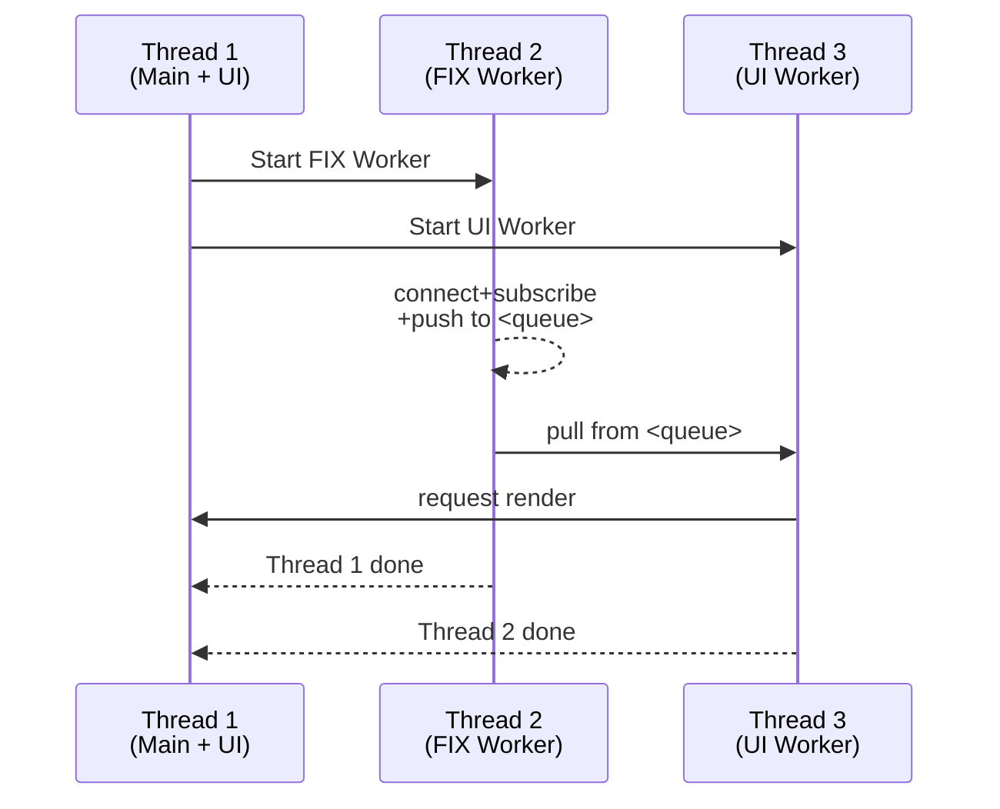

# DESIGN

```mermaid
sequenceDiagram
    participant T1 as Thread 1<br>(Main + UI)
    participant T2 as Thread 2<br>(FIX Worker)
    participant T3 as Thread 3<br>(UI Worker)

    T1->>T2: Start FIX Worker
    T1->>T3: Start UI Worker
    T2-->>T2: connect+subscribe<br>+push to <queue>
    T2->>T3: pull from <queue>
    T3->>T1: request render
    T2-->>T1: Thread 1 done
    T3-->>T1: Thread 2 done
```
